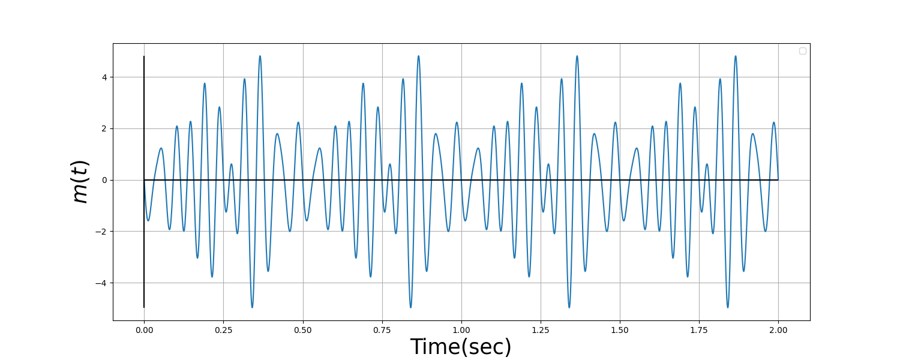
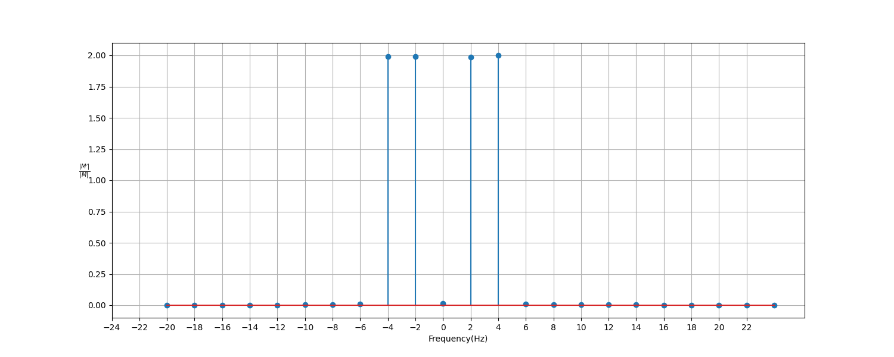
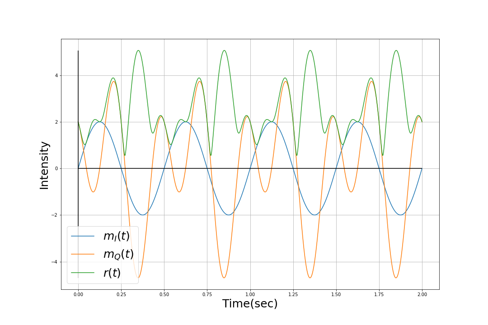
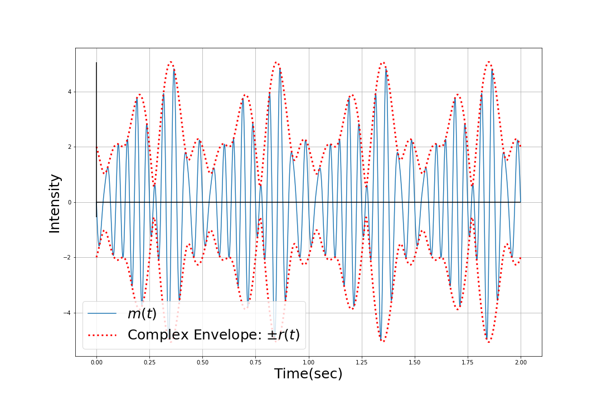
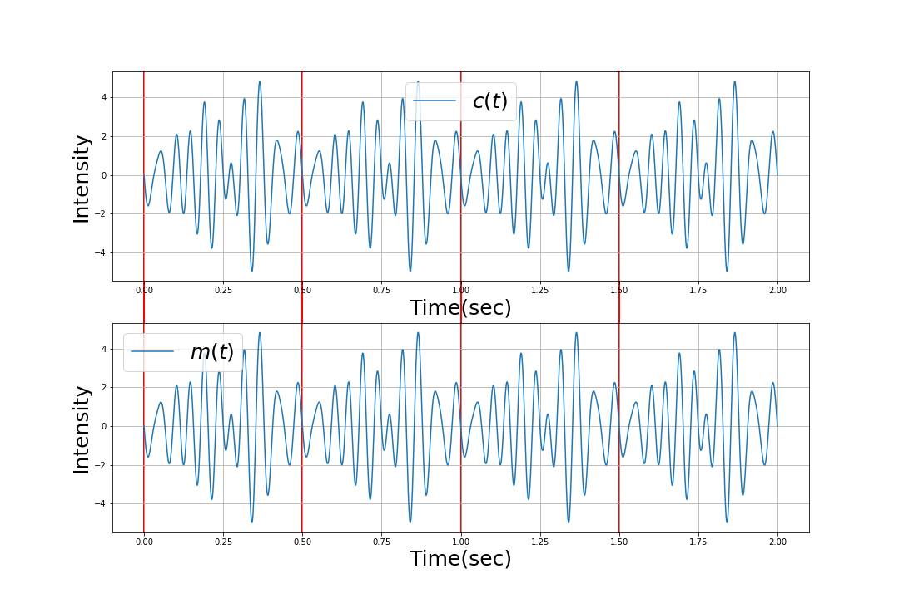

# Communication Theory Homework
## requirements
- numpy
- scipy
- matplotlib
- python >= 3.10
## Usage
```bash
python homework1.py
```
## Introduction
This homework is aims to simulate a signal $m(t)$ do base-band modulation.
- The signal $m(t)$ is defined as:
  $m(t)=[\cos(32\pi t) - \sin(32\pi t)]+[-\cos(36\pi t) - \sin(36\pi t)] + [\cos(44\pi t) + \sin(44\pi t)] + [-\cos(48\pi t) - \sin(48\pi t)]$
  
- Then shift center frequency to 0 Hz
  
- The envelope and imagnary and real part signal
  
- The evelope and actual signal
  
- Check the base-band signal$c(t)=m_I(t)\cdot\sin(2\pi 20t) - m_Q(t) \cdot\cos(2\pi 20t)$ is correct.
  
